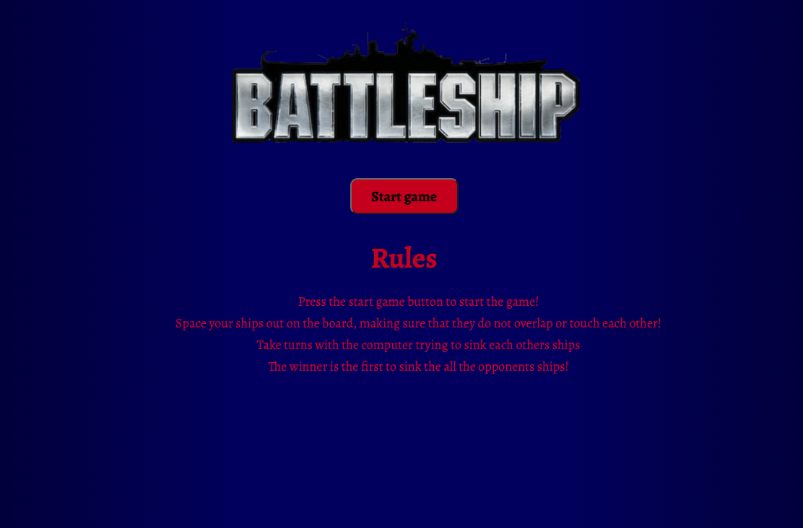

# Project One 

## Deployed Link
https://jonty-ward.github.io/sei-project-1/

# Approach taken 
## Key Dates
* Day 1: planning
* Day 2-5: hit MVP and improved computer ship placement 
* Day 5 - 6: improving player ship placement and computer shooting logic, 
* Day 7 - 8: bug fixes, styling, soundtrack, and nice to have extras

## Day 1
I spent the first day of the project breaking down the game into small, manageable sections. I spent the day designing the game, writing the pseudo code for the game and creating a timeline for myself to work towards. I knew that the most difficult part of the game would be the logic for the computer shooting the players ships, so this was an area I spent a lot of my time planning. 

## Day 2-5
For the MVP, I wanted the player to be able to place their ships on the board, horizontally and vertically,  I wanted the computer to place their ships randomly, and I wanted the computer and player to be able to shoot at each other. With this in mind I created the grids, and started to try and add the ships. At the start I planned on creating the ships as separate pieces, and overlay them on top of the grid. This was a real challenge to achieve, so I decided to go back to the drawing board and start again with the ships.  I settled on making an object for each of the ships. The object contained the length of the name, length, default orientation (which enabled having a horizontal/vertical ship later), and the board that they were to be placed on. The cells that would contain the ship were then populated with the classes needed for gameplay and styling.

In order to place player pieces the player would select a ship from the available options, and when they clicked a cell on the grid the ship data would be populated onto the relevant cells- vertical or horizontal. 

Once the player ships were able to be placed on the board, I noticed a bug- the player could overlap ships or place them over the edge of the board, which would make it impossible to lose. This needed to be addressed, however I decided to focus on getting the game up and running. This was a task for once I had finished the MVP. 

I moved onto getting the computer to place ships. This seemed like a simple matter of choosing a random square from the grid squares, and following the logic from adding the player ships. I created a random generator to flip the computer's ship axis randomly to simulate a player choosing the axis of the ship. The logic was very similar to adding a players ship. I encountered the same bug as I did for placing the players ships- they could overlap or end up off the board. I decided to tackle the placement of the computer ships now before working on the gameplay. 

I created a function that checked if the ships would intersect another ship on any of the ships squares, or if the ship would go over the edge of the board. I used the ships starting position, and the orientation of the ship to write a function to check if any of the squares for the ships projected position intersected with a square that had the classname of ship (.classList.contains(‘ship’)). The function checked this condition for each of the ship's pieces. If the projected position for the ship satisfied the requirements, then the ship would be added to the board. The code snippet below shows a section of this function that checks if the ships are overlapping, or next to each other. 

Now that the pieces were being rendered on the board, I implemented the players shooting functionality. This was straightforward. I created a variable to track if the square had been chosen before, to prevent players from selecting the same square multiple times. If the event.target contained the class ship, a class was added to this square to visually indicate the ship had been hit, then a series of if statements determined which ship had been shot at and decrease the number of lives this ship had until it was destroyed. This would later be displayed on screen and would be involved in the win logic. 

To complete the very basic MVP I added random shooting for the computer. This meant the computer chose a random square, and followed the same logic as the player shooting in order to destroy a player's ship. The big issue with this was there was no intelligence to the shooting. The computer could hit a players ship, and then shoot at the other side of the board, often at a square that had been shot at before. Improving this would be for my post MVP tasks. 

## Day 5-6
Now that I had this error handling working, I decided I would implement the same thing so the player could only place their pieces in positions that would make logical sense. I added some visual displays so that when a ship there was visual feedback to the user, and they could not add the ship in that location. Ships could not be stacked on top of each other, or all connecting to eachother. 

My biggest challenge in the project was to develop more intelligent computer shooting. I wanted the computer to be able to, once it had hit a players ship, choose from the available options left (to the left, right, above or below). I achieved this with a series of if-else statements that updated the possible locations of the rest of the ship based on the result of the previous shot. This array had to update based on what happened next. If the second shot was a vertical hit, then it needed to change the possible squares accordingly to the square above, and one below the original square. The computer would randomly select the available squares until the ship was destroyed, where it would then continue to randomly target the board.  The gif below illustrates the computer's intelligent shooting in action! 

## Day 7-8
Up until this point, there was no styling on the site, and there was no landing or win page. The logic for the intelligent placing of the pieces, and the intelligent shooting had taken up a lot more time than I had anticipated- I also tried to work on bugs as I found them!

My initial idea for the styling was far more complex than my final result- I had planned on implementing a Pirates of the Caribbean theme, however I did not have time to put this into practice, but would be something i would look to improve on if I had the chance to redo the project. 

My first task in styling was to create a colour theme. I chose a nautical themed background gradient I created in CSS. This involved using a linear gradient as the background colour. I then changed the colour of the gridlines, and added some a strong red to compliment the background colour. 

I then decided to try and add some ship images to the ships- I tried to add these in as a background image and have it overflow across all squares. This was very fiddly, but I eventually got this to work. The problem I had was when I rotated the ship, the background image stayed horizontal. This was a problem that had been scratching my head for a long time. I decided in the interest of saving time to have a different colour for each ship and added small images to each of the squares, and an image to the buttons instead. In order to add the images I had to make them on transparent backgrounds in Photoshop which was much more time consuming that I had thought. This small bit of styling took the best part of day 7. 

On day 8 I had a lot I wanted to cram into the project before the deadline. I wanted a landing page, a message to the user based on what was happening, audio, and a win screen. I also wanted some aspect of responsive design to the site. 

In order to get the message banner to work, I added in code that altered the bannerMessage.innerHTML to display the relevant messages. A code snippet for some of the messages that are displayed in the banner, as well as a gif showing some of the messages that the player will receive in the game! 

Now that I have the banner message up and running I build the landing page and win screen. These were achieved by adding and removing the classname ‘hidden from components on the page. This was a very simple solution, and allowed me to create the appearance of having multiple pages on the site. This allowed me to display the windscreen when either the player, or computer won the game, and also allowed me to control what was displayed on landing on the page. Below are screenshots of the three different ‘pages’ of the game. 

I finished off the project by adding some media queries to add a degree of responsiveness so that the game could be played on different sized screens, including mobile, and finally adding the sound-track. I chose the pirates of the caribbean theme tune as a small nod to my initial plan of theming the app based on Pirates of the Caribbean! 

# Wins and blockers 

* The biggest blocker for me was the placement of the ship images over the ship. This was something that I ended up leaving off the project in the end. This was something that wasn't essential to the game, but I feel would have elevated the games aesthetic and made it look more professional. 
* There is one bug that I did not have time to fix, that would improve the play of the game. The computer ships can sometimes align themselves next to each other. This was a bug I only noticed last minute. Looking back on it, I could modify the condition that prevents the ships from stacking to prevent them being next to one another as I did for the placement of the players ships 
* The thing I would improve on if I could go back and do the project again would be to write cleaner, clearer code. I think that refactoring could help eliminate some of the complexity, and help with issues that I encountered in the build. 
* The biggest win for me was getting the intelligent shooting from the computer. This took a lot of thinking about and adjustment, but makes the game work much better than just random shooting from the computer. 

# Key Learnings
* My biggest takeaway from this project was taking the individual elements we had learnt through the course, and figuiring out how to applly these concepts into a single project. Working by myself gave me the chance to consolidate what I had been taught, and become much more comfortable with JavaScript. 

# Future improvements 
* Different difficulty levels- more intelligent shooting from computer
* Refactoring 
* Update the styling to be inline with my Pirates of the Caribbean theme 
* More Audio, in theme with a Pirates of the Carribean theme 
* Adding features like special attacks the player can ‘buy’ when build up enough points
* Two player functionality  

